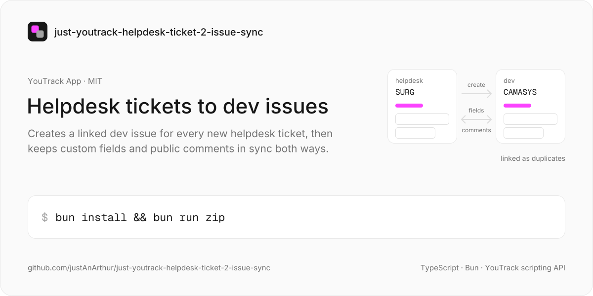
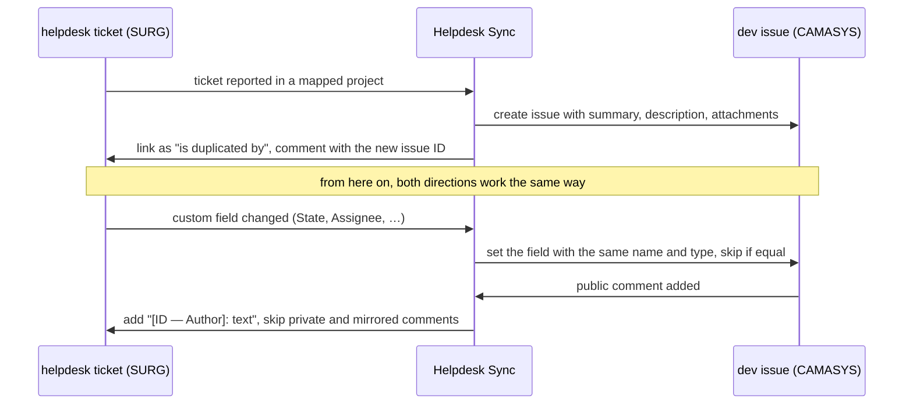

<a href="https://github.com/justAnArthur/just-youtrack-helpdesk-ticket-2-issue-sync"></a>

# just-youtrack-helpdesk-ticket-2-issue-sync

**Helpdesk Sync**, a YouTrack App that automatically creates linked dev issues from helpdesk tickets and keeps fields and comments in sync **bidirectionally**.

```bash
bun install && bun run zip    # → helpdesk-sync.zip, upload it in Administration → Apps
```

## What it does

- **Auto-create linked issue** — when a helpdesk ticket is created, a linked dev issue is automatically created in the configured target project (with description and attachments copied)
- **Bidirectional field sync** — any custom field change (State, Assignee, Priority, etc.) is synced to the linked issue and back, as long as both projects have a field with the same name and type
- **Bidirectional comment sync** — public comments are mirrored between linked issues in both directions (private comments are skipped; already-mirrored comments are detected to prevent loops)
- **Error alerts** — when something goes wrong, a collapsible ⚠️ comment is added directly on the issue so problems are visible

## Configuration

After installing the App in YouTrack, go to **Administration → Apps → Helpdesk Sync → Settings** and set the **Project Map** value.

### Project Map format

A comma-separated list of `FROM-TO` pairs, where `FROM` is the helpdesk project key and `TO` is the target dev project key:

```
SURG-CAMASYS,SFI-CAMASYS
```

This example maps:
- `SURG` (helpdesk) → `CAMASYS` (dev)
- `SFI` (helpdesk) → `CAMASYS` (dev)

## How it works

three on-change workflow rules (the three `*-issue.ts` files in `src/`), all driven by the same Project Map:



### Link type

Issues are linked using the built-in **Duplicate** link type (`"is duplicated by"` / `"duplicates"`). Both link directions are followed for bidirectional sync.

### Field sync logic

1. On any issue change, the guard iterates all custom fields in the project to detect changes
2. For each changed field, the action looks for a field with the **same name and type** in the linked issue's project
3. **Bundle-type fields** (State, Enum, Owned, Version, Build) are resolved by value name via `findValueByName()`
4. **User and simple fields** (Assignee, dates, strings, numbers) are assigned directly
5. If the target value already matches the source, the write is skipped (prevents infinite sync loops)

### Comment sync logic

1. When a comment is added, it is mirrored to all linked issues in mapped projects
2. Private comments (with visibility restrictions) are skipped
3. Mirrored comments use a `[ISSUE-ID — Author]: ` prefix — comments matching this pattern are detected and skipped to prevent infinite loops

## Develop

### Prerequisites

- [Bun](https://bun.sh) runtime

### Install dependencies

```bash
bun install
```

### Build

```bash
bun run build
```

`scripts/build.ts` bundles the three rules to CommonJS in `dist/`, copies `settings.json` and `logo.svg`, and writes `dist/manifest.json` with the version, description and vendor taken from `package.json`.

### Build & zip for upload

```bash
bun run zip
```

This produces `helpdesk-sync.zip` ready to upload via **Administration → Apps** in YouTrack.

### Upload directly (requires `youtrack-workflow` CLI)

> not wired up yet: `package.json` has no `upload` script and there is no `.env.example` in the repo. until then, upload the zip by hand.

Copy `.env.example` to `.env` and fill in your values:

```bash
cp .env.example .env
```

```dotenv
YT_HOST=https://your-instance.youtrack.cloud
YT_TOKEN=perm:your-permanent-token
```

Then run:

```bash
bun run upload
```

## Structure

```
src/
  auto-create-linked-issue.ts   # Creates linked dev issue on ticket creation
  sync-state-to-issue.ts        # Bidirectional sync of all custom fields
  sync-comment-to-issue.ts      # Bidirectional sync of comments
  settings.ts                   # Shared config parsing & utilities
  settings.json                 # App settings schema (projectMap)
  manifest.json                 # YouTrack App manifest
scripts/build.ts                # Build script (Bun)
public/logo.svg                 # App icon
```

## License

MIT
